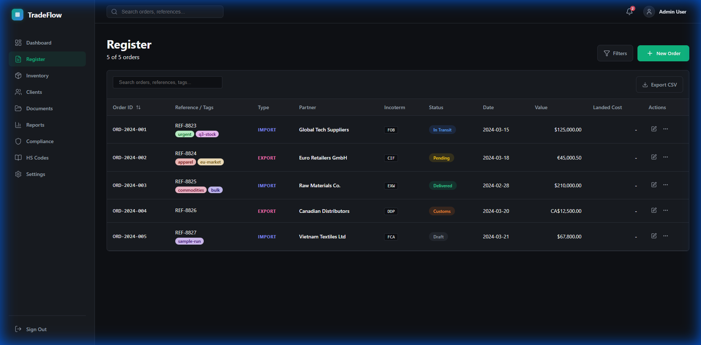
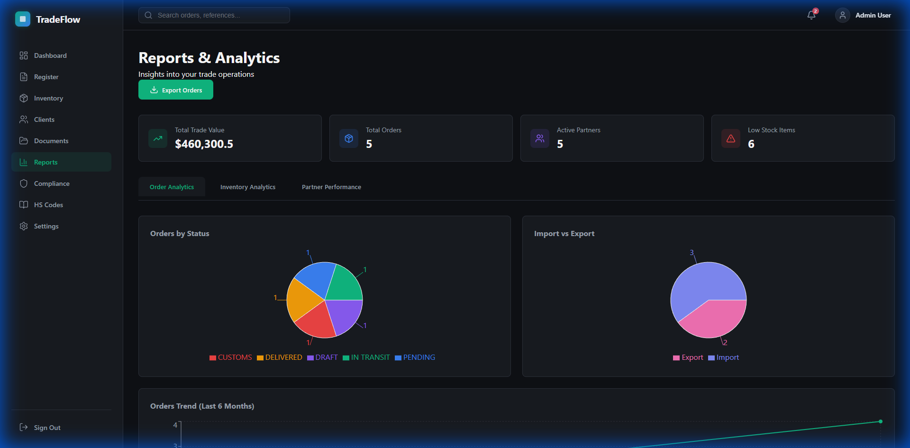
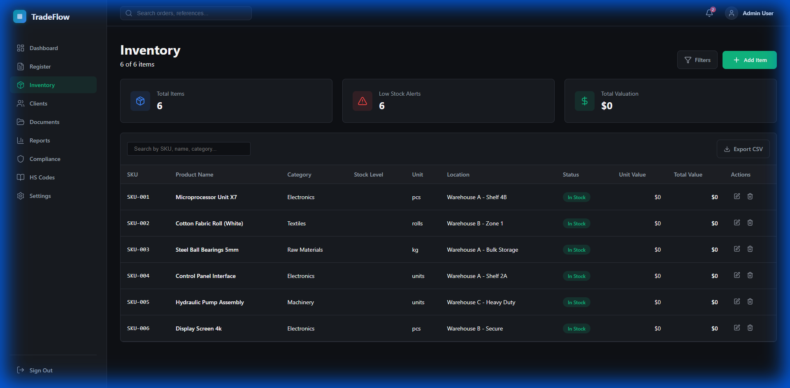
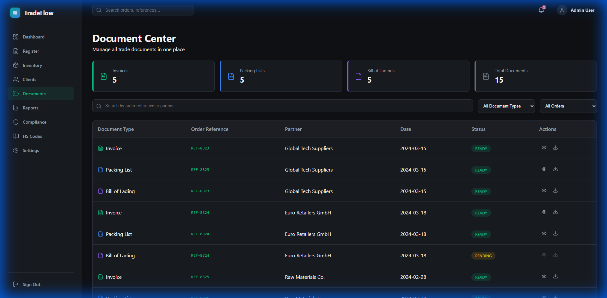
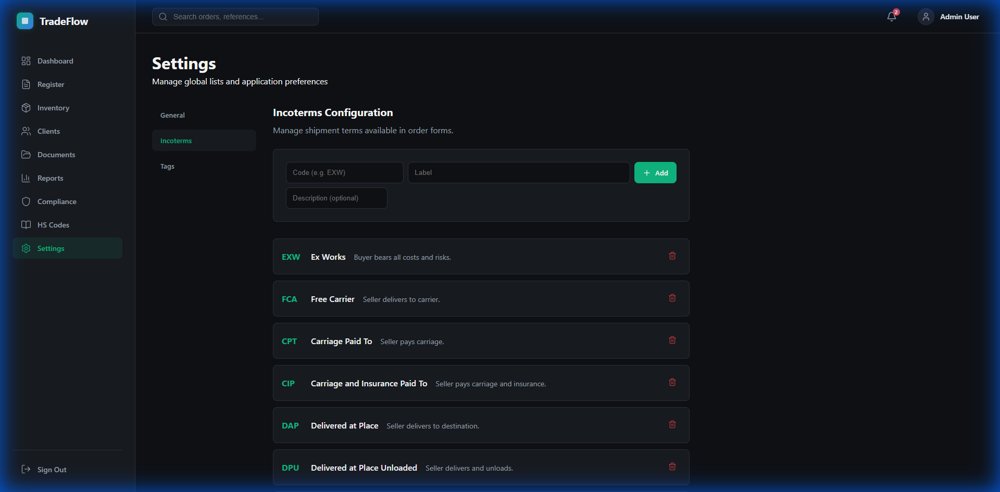

<p align="center">
  
  
  
</p>

<h1 align="center">🌐 TradeFlow</h1>

<p align="center">
  <strong>A Modern Import/Export Register & Trade Management Application</strong>
</p>

<p align="center">
  <em>Streamline your international trade operations with comprehensive order tracking, compliance management, and intelligent analytics.</em>
</p>

---

## 📋 Table of Contents

- [Overview](#-overview)
- [Features](#-features)
- [Screenshots](#-screenshots)
- [Tech Stack](#-tech-stack)
- [Installation](#-installation)
- [Usage Guide](#-usage-guide)
- [Project Structure](#-project-structure)
- [Contributing](#-contributing)
- [License](#-license)

---

## 🎯 Overview

**TradeFlow** is a comprehensive, enterprise-grade import/export register application designed for businesses engaged in international trade. Built with modern web technologies, it provides an intuitive interface for managing trade orders, ensuring compliance, tracking inventory, and generating insightful reports.

### Why TradeFlow?

- 📊 **Real-time Analytics** - Monitor your trade operations with dynamic dashboards
- 🛡️ **Compliance First** - Built-in sanctions screening and restricted party checks
- 📄 **Document Generation** - Auto-generate commercial invoices, packing lists, and more
- 🔄 **Complete Incoterms Support** - All 11 Incoterms 2020 rules supported
- 💼 **Professional UI** - Sleek, dark-themed interface designed for productivity

---

## ✨ Features

### 📊 Interactive Dashboard
- Real-time statistics for imports and exports
- Order status distribution visualization
- Recent activity timeline
- Quick access to key metrics (total value, pending orders, active clients)

### 📝 Order Register
- Comprehensive order entry form with 20+ fields
- Support for both import and export orders
- Full Incoterms 2020 selection
- HS Code integration for product classification
- Multi-product order support with detailed line items
- Order timeline and status tracking

### 📈 Reports & Analytics
- Dynamic charts for order analysis
- Import vs Export comparison
- Status-based filtering
- Date range analysis
- Export data to CSV/PDF formats

### 🛡️ Compliance Center
- Real-time party screening against sanctions lists
- OFAC, EU, and UN sanctions database integration
- Restricted countries monitoring
- Compliance score tracking
- Risk assessment alerts

### 📦 Inventory Management
- Complete product catalog management
- Stock level tracking with low-stock alerts
- SKU management
- Category-based organization
- Total valuation calculations

### 📄 Document Center
- Commercial Invoice generation
- Packing List creation
- Bill of Lading templates
- Certificate of Origin
- Document preview and download

### ⚙️ Settings & Configuration
- Incoterms customization
- Global lists management (countries, currencies, ports)
- Application preferences
- User profile settings

---

## 📸 Screenshots

### Dashboard
*Central hub displaying key metrics, recent orders, and quick statistics for your trade operations.*


---

### Order Register
*Comprehensive order management with detailed entry forms and a powerful data table for tracking all import/export orders.*



---

### Reports & Analytics
*Visual analytics with interactive charts showing order distribution, import/export comparisons, and trend analysis.*



---

### Compliance Center
*Built-in compliance tools with party screening, sanctions checking, and restricted countries monitoring.*


---

### Inventory Management
*Complete product catalog with stock tracking, low-stock alerts, and total valuation metrics.*



---

### Document Center
*Generate and manage trade documents including commercial invoices, packing lists, and certificates.*



---

### Settings
*Configure Incoterms, manage global lists, and customize application preferences.*



---

## 🛠️ Tech Stack

| Technology | Purpose |
|------------|---------|
| **React 18.3** | Frontend UI library |
| **Vite 7.3** | Build tool & dev server |
| **React Router 7** | Client-side routing |
| **Recharts** | Chart & data visualization |
| **jsPDF** | PDF document generation |
| **Vitest** | Unit testing framework |
| **ESLint** | Code quality & linting |

---

## 🚀 Installation

### Prerequisites

- Node.js 18+ 
- npm or yarn

### Quick Start

1. **Clone the repository**
   ```bash
   git clone https://github.com/Hits17/TradeFlow.git
   cd TradeFlow
   ```

2. **Install dependencies**
   ```bash
   npm install
   ```

3. **Start the development server**
   ```bash
   npm run dev
   ```

4. **Open your browser**
   ```
   http://localhost:5173
   ```

### Build for Production

```bash
npm run build
```

The production build will be generated in the `dist/` folder.

---

## 📖 Usage Guide

### Creating an Order

1. Navigate to the **Register** page
2. Click **"Add New Order"** button
3. Fill in the order details:
   - Select order type (Import/Export)
   - Enter client information
   - Choose Incoterms
   - Add product details with HS codes
   - Set shipping information
4. Click **Submit** to save the order

### Screening for Compliance

1. Go to the **Compliance** page
2. Enter the party name in the screening tool
3. Click **Screen** to check against sanctions lists
4. Review the results and compliance score

### Generating Documents

1. Navigate to the **Documents** page
2. Select an order from the dropdown
3. Choose the document type to generate
4. Click **Generate** to create the document
5. Preview and download as PDF

### Viewing Reports

1. Access the **Reports** page
2. Use filters to narrow down data by date range or status
3. View interactive charts and analytics
4. Export data using the export buttons

---

## 📁 Project Structure

```
TradeFlow/
├── public/                 # Static assets
├── src/
│   ├── components/         # Reusable UI components
│   │   ├── inventory/      # Inventory-related components
│   │   ├── layout/         # Header, Sidebar, MainLayout
│   │   ├── register/       # Order form and table
│   │   └── ui/             # Common UI elements
│   ├── context/            # React Context providers
│   ├── data/               # Mock data and constants
│   ├── pages/              # Page components
│   ├── utils/              # Utility functions
│   ├── App.jsx             # Main App component
│   ├── index.css           # Global styles
│   └── main.jsx            # Entry point
├── screenshots/            # Application screenshots
├── package.json            # Dependencies & scripts
└── vite.config.js          # Vite configuration
```

---

## 🤝 Contributing

Contributions are welcome! Here's how you can help:

1. **Fork** the repository
2. **Create** a feature branch (`git checkout -b feature/amazing-feature`)
3. **Commit** your changes (`git commit -m 'Add amazing feature'`)
4. **Push** to the branch (`git push origin feature/amazing-feature`)
5. **Open** a Pull Request

### Development Guidelines

- Follow the existing code style
- Write meaningful commit messages
- Add tests for new features
- Update documentation as needed

---

## 📄 License

This project is licensed under the **MIT License** - see the [LICENSE](LICENSE) file for details.

---

<p align="center">
  <strong>Built with ❤️ for International Trade Professionals</strong>
</p>

<p align="center">
  <a href="https://github.com/Hits17/TradeFlow/issues">Report Bug</a>
  ·
  <a href="https://github.com/Hits17/TradeFlow/issues">Request Feature</a>
</p>
